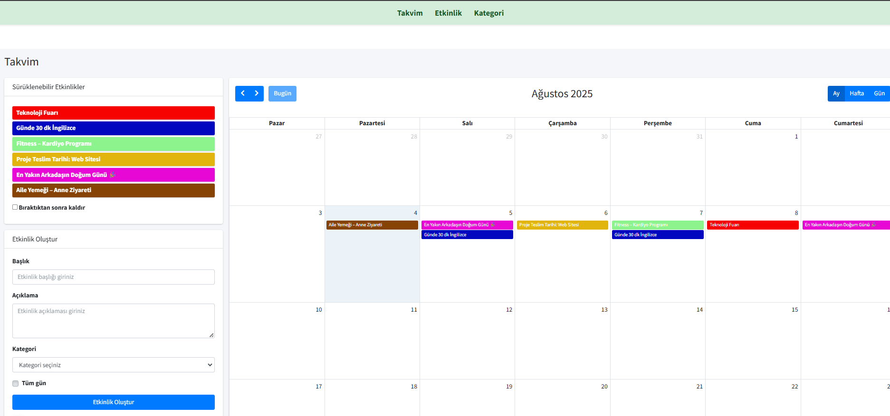
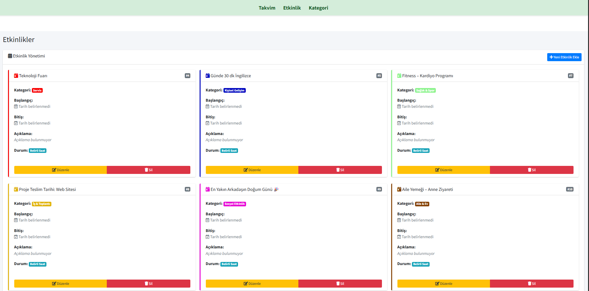
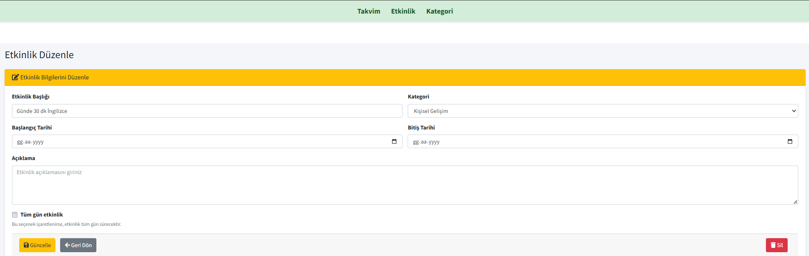
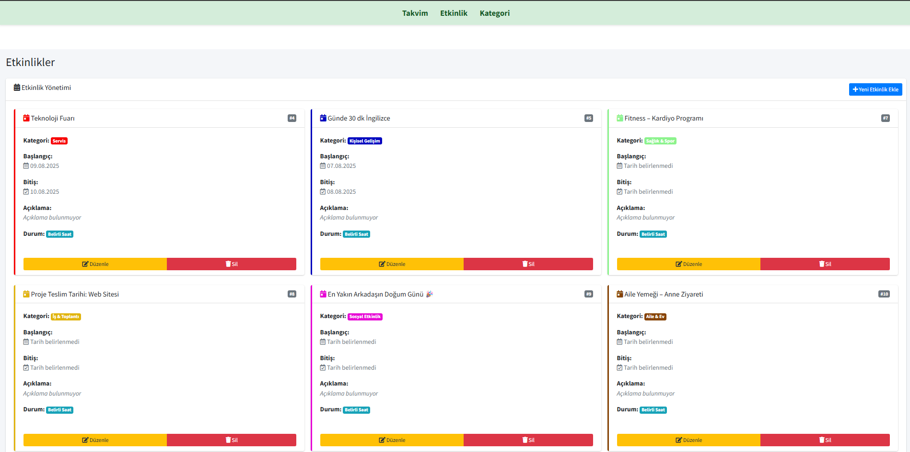

# 📅 Etkinlik Takvimi Uygulaması

Kullanıcıların günlük planlarını kolayca yönetmesini sağlayan, interaktif takvim özellikleriyle zenginleştirilmiş bir ASP.NET MVC uygulamasıdır. Etkinlikler kategori bazlı sınıflandırılır ve tüm işlemler kullanıcı dostu bir arayüzle gerçekleştirilir.

---

## 🚀 Özellikler

### 🏷️ Kategori Bazlı Etkinlik Sınıflandırma
- Etkinlikler, kullanıcı tarafından belirlenen isim ve renklere sahip kategorilere atanabilir.  
- Renk kodları ile görsel olarak ayrıştırma sağlanır.

### 📆 Dinamik ve Etkileşimli Takvim
FullCalendar.js entegrasyonu sayesinde:
- Etkinlikleri takvim üzerinden sürükle-bırak ile taşıma
- Detayları anında görüntüleme
- Takvim üzerinden doğrudan yeni etkinlik başlatma

### 🔄 Sayfa Yenilemeden İşlem (AJAX)
- Etkinlik oluşturma  
- Etkinlik güncelleme  
- Etkinlik silme  
Yukarıdaki işlemler sayfa yenilenmeden yapılabilir.

### ⏰ Tüm Gün Etkinlik Tanımı
- Günü tamamen kapsayan etkinlikler tanımlanabilir.  
- `IsAllDay` özelliği ile uzun süreli etkinlikler kolayca yönetilebilir.

---

## 💻 Kullanılan Teknolojiler

- **ASP.NET MVC 5**  
- **Entity Framework (Code First)**  
- **Microsoft SQL Server**  
- **FullCalendar.js**  
- **jQuery / AJAX**  
- **Bootstrap 4**

---

## 📸 Ekran Görüntüleri

### 📅 Takvim Arayüzü  

---

### 🗂️ Kategori Yönetimi  

---

### ✏️ Etkinlik Düzenleme  

---

### 📋 Etkinlik Listesi  

---
